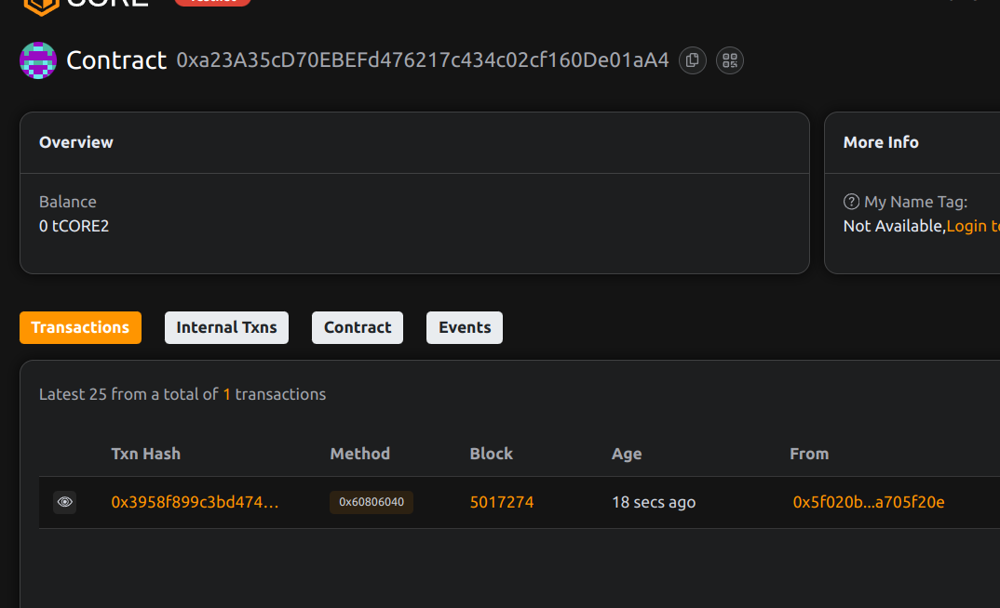

                  # Project Title: EvoNFT: Time-Evolving Non-Fungible Tokens

## Project Description

EvoNFT introduces dynamic NFTs that evolve over time or through owner-triggered events. Each token maintains a history of its visual or metadata states, allowing NFTs to represent transformation, growth, or aging.

## Project Vision

To revolutionize digital art and collectibles by enabling time-bound or milestone-driven transformations within NFTs, making them interactive and narrative-driven assets.

## Key Features

- ERC-721 compliant time-evolving NFTs
- Owner-controlled metadata evolution
- Transparent historical tracking of all token states
- Ideal for storytelling, gaming, and progressive digital art

## Future Scope

- On-chain evolution logic based on game state, time, or price feeds
- DAO voting to trigger public evolutions
- Integration with generative art engines and dynamic SVG rendering
- Time-locked NFT vaults with unlockable evolutions

## Contract Details
project done by Rajvardhan Singh 

0xa23A35cD70EBEFd476217c434c02cf160De01aA4
